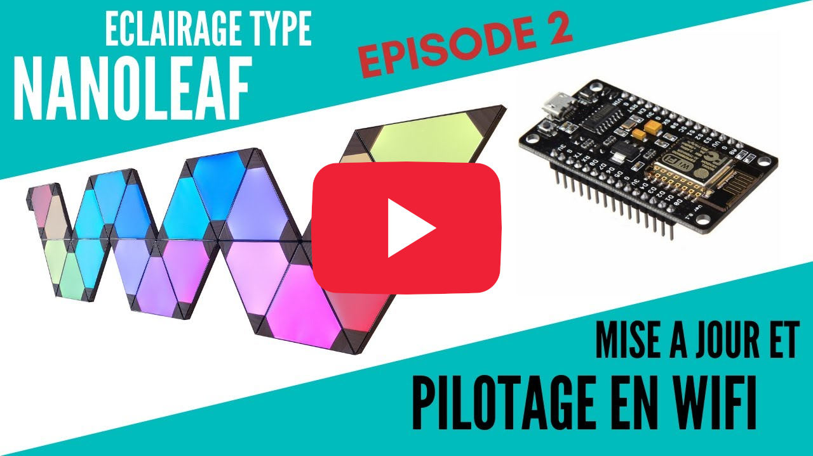
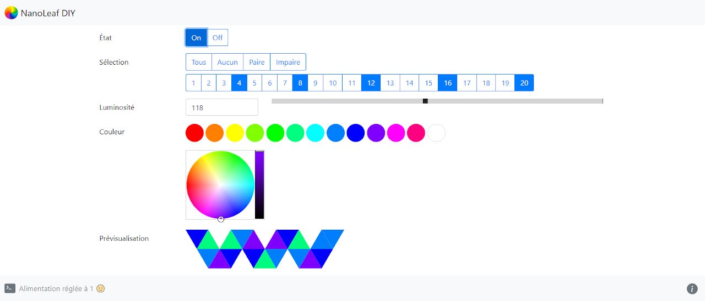
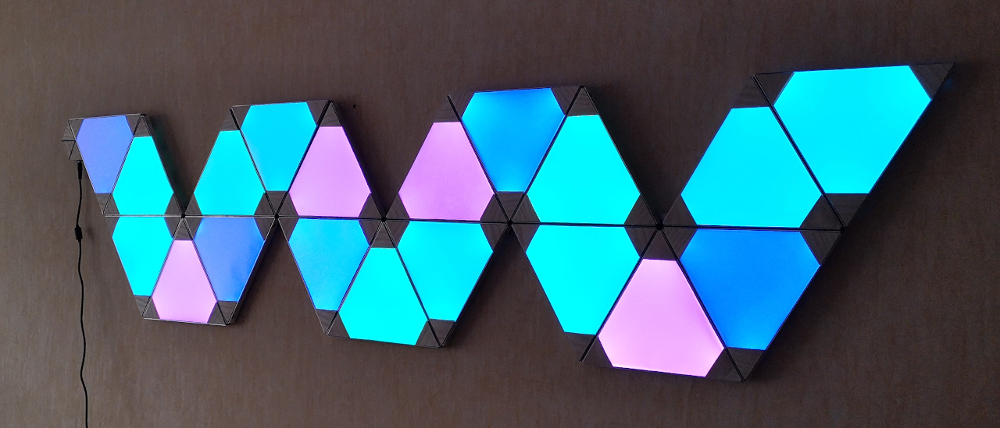

# NanoLeaf DIY WebServer

Cette **application** a pour but de faciliter la **gestion** de **panneaux lumineux DIY** (type NanoLeaf) grâce à un microcontrôleur **ESP8266** depuis un appareil (ordinateur, tablette, smartphone) connecté à un **réseau local Wi-Fi**.

| [](https://www.youtube.com/watch?v=Diy4EA5iPeo) | [](https://www.youtube.com/watch?v=Diy4EA5iPeo) |
| :---: | :---: |
| *Tutoriel vidéo par [Atel Yeah](https://www.youtube.com/channel/UCkJ7AFKJVCajGVOGWAORAlA) : Épisode n°1* | *Tutoriel vidéo par [Atel Yeah](https://www.youtube.com/channel/UCkJ7AFKJVCajGVOGWAORAlA) : Épisode n°2* |

- Projet développé en collaboration avec [Atel Yeah](https://www.youtube.com/channel/UCkJ7AFKJVCajGVOGWAORAlA), une **chaîne YouTube** d'éco-conception et de fabrication DIY.
- Projet inspiré de [ESP8266 FastLED IoT Webserver](https://github.com/NimmLor/esp8266-fastled-iot-webserver) développé par **NimmLor**

## Captures d'écran :

|  |  |
| :---: | :---: |
| *Application de contrôle* | *Panneaux lumineux DIY* |

## Installation :

#### Dépendances

- Installer [Arduino IDE](https://www.arduino.cc/en/Main/Software) pour pouvoir **compiler** et **téléverser** le programme.
- Ajouter [Arduino core for ESP8266 WiFi](https://github.com/esp8266/Arduino) à **Arduino IDE** pour pouvoir **gérer** le microcontrôleur **ESP8266**.
- Ajouter [Arduino ESP8266 LittleFS Filesystem Uploader](https://github.com/earlephilhower/arduino-esp8266littlefs-plugin) à **Arduino IDE** pour pouvoir **téléverser** les fichiers dans la **zone mémoire** du microcontrôleur **ESP8266**.
- Installer [Adafruit NeoPixel Library](https://github.com/adafruit/Adafruit_NeoPixel) pour pouvoir **contrôler** les LED.

#### Programme

- Configurer le programme (lignes 13 à 41) dans **Arduino IDE** (détails de toutes les options ci-dessous).
- Compiler et téléverser le programme avec **Arduino IDE**.

#### Fichiers

- Téléverser les fichiers dans la zone mémoire en cliquant sur **ESP8266 LittleFS Data Upload** dans le menu **Outils** de **Arduino IDE**.

## Mise à jour :

Le programme peut être **mis à jour à distance (OTA)** en sélectionnant le **port** correspondant à votre microcontrôleur **ESP8266** dans le menu **Outils** de **Arduino IDE**. La connexion est sécurisée par un **mot de passe** personnalisable (voir les options ci-dessous).

## Configuration :

| Option					  | Valeur par défaut    | Description |
| :---------------: | :------------------: | :---------: |
| `WIFI_SSID` 		  | `"Nom_Wifi"` 				 | Le nom du réseau Wi-Fi. |
| `WIFI_PASSWORD`   | `"MotDePasse_Wifi"`  | Le mot de passe du réseau Wi-Fi. |
| `WIFI_MAXTRY` 	  | `15` 								 | Le nombre de tentative de connexion au réseau Wi-Fi. |
| `SERVER_PORT` 	  | `80` 								 | Le port utilisé par le serveur HTTP. |
| `HOST_NAME` 		  | `"nanoleaf-diy"` 		 | Le nom d'hôte du serveur propagé par mDNS. |
| `OTA_NAME`        | `"OTA NanoLeaf DIY"` | Le nom de la connexion OTA (mise à jour sans fil). |
| `OTA_PASSWORD`    | `"diy"`              | Le mot de passe de la connexion OTA (mise à jour sans fil). |
| `LED_PIN` 			  | `D2` 								 | La broche sur laquelle est branchée le câble DATA du strip LED.<br />Attention en utilisant la broche D4, la LED intégrée à la carte sera également constamment allumée. |
| `IS_RGBW` 			  | `1` 								 | Indique si le strip LED est de type RGBW. `Oui : 1` ; `Non : 0` |
| `LED_COUNT` 		  | `12` 								 | Le nombre de LED par panneau NanoLeaf. |
| `PANEL_COUNT` 	  | `5` 								 | Le nombre de panneaux NanoLeaf. |
| `PANEL_DIRECTION` | `"horizontal"`       | La direction des panneaux NanoLeaf. `Montage horizontal : "horizontal"` ; `Montage vertical : "vertical"` |
| `PANEL_GRID` | `"1-2-top,2-2-bottom,2-1-top,3-1-bottom,'4-1-top"` | La structure des panneaux NanoLeaf. **Codage détaillé ci-dessous** |
| `POWER` 				  | `0`                  | L'état de l'alimentation par défaut. `Allumé : 1` ; `Éteint : 0` |
| `BRIGHTNESS` 		  | `50` 								 | La luminosité par défaut. `Min : 0` ; `Max : 255` |
| `COLOR_R` 			  | `255` 							 | La valeur du canal rouge de la couleur par défaut. `Min : 0` ; `Max : 255` |
| `COLOR_G` 			  | `255` 							 | La valeur du canal vert de la couleur par défaut. `Min : 0` ; `Max : 255` |
| `COLOR_B` 			  | `0` 								 | La valeur du canal bleu de la couleur par défaut. `Min : 0` ; `Max : 255` |

#### Codage de la structure des panneaux :

La **structure** des panneaux NanoLeaf est **codée** avec une **chaîne** contenant la **position** de **chaque panneau** dans l'**ordre de branchement**. Chaque position est **séparée** par une **virgule**.

La **position** d'un panneau NanoLeaf contient **3 informations** séparées par un **tiret** :
- Le numéro de la colonne où est situé le panneau.
- Le numéro de la ligne où est situé le panneau.
- La direction vers laquelle pointe la pointe du panneau.

*Exemples :*
- `1-3-top` : Panneau situé à la 1<sup>ere</sup> colonne, 3<sup>e</sup> ligne et une pointe dirigée vers le haut.
- `2-5-left` : Panneau est situé à la 2<sup>e</sup> colonne, 5<sup>e</sup> ligne et une pointe dirigée vers la gauche.

*Grille à utiliser :*
```
| 1-1 | 2-1 | 3-1 | 4-1 | 5-1 | ... |
| 1-2 | 2-2 | 3-2 | 4-2 | 5-2 | ... |
| 1-3 | 2-3 | 3-3 | 4-3 | 5-3 | ... |
| ... | ... | ... | ... | ... | ... |
```

## A venir :

- [ ] Palettes de couleurs.
- [ ] Effets entre les différents panneaux.

## License :

Cette application est sous licence MIT
